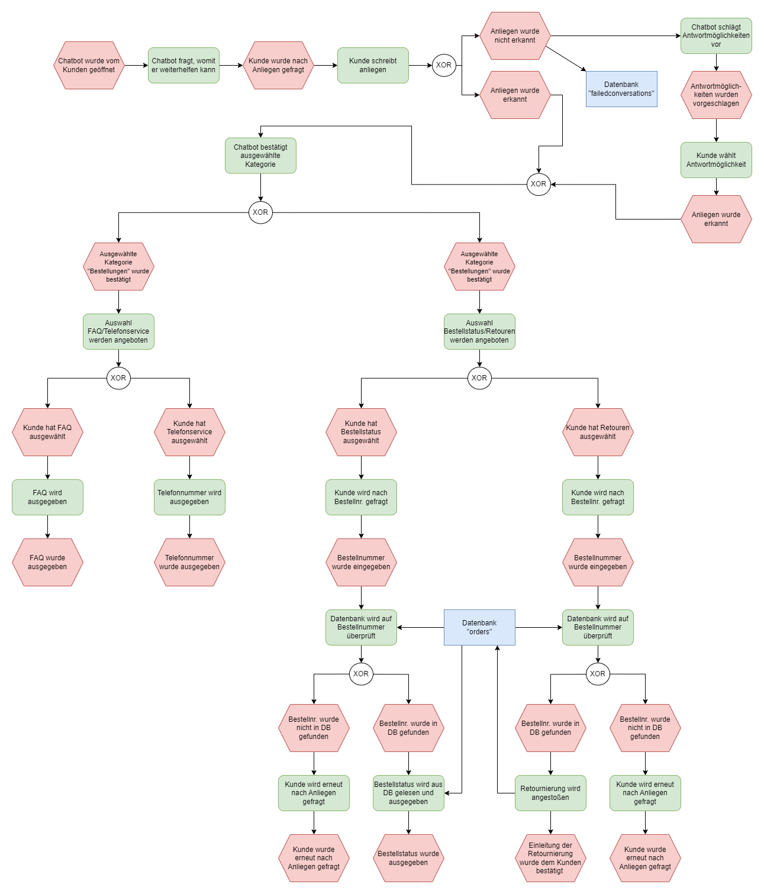

# LF6 Chatbot

Dieses Repository enthält den Code für unseren Chatbot zur Beantwortung von Serviceanfragen.

## Table of Contents

- [About](#about)
- [Requirements](#requirements)
- [Setup](#setup)
  - [Development](#setup-development)
  - [Production](#setup-production)

## About

Zusätzlich zu unserem LLM (Large Language Model) haben wir einen Chatbot entwickelt, welcher unserem EPK und den Anforderungen des Lernfeldes enstpricht.
Hierbei haben wir uns für eine "Harcoded" Lösung entschieden, da wir so den Gesprächsablauf zwischen dem Kunden und Bot besser leiten können, durch Themen Vorschläge und Fragen.
Der Bot filtert Keywords aus dem Nutzerinput und gibt daraufhin einen Vorschlag zur weiteren Bearbeitung des Problems.
Ist der Bot nicht in der Lage eine Serviceanfrage zu beantworten, wird der Nutzer an den Telefonsupport weitergeleitet und die Conversation in einer Datenbank gespeichert.

Der Bot ist in der Lage leichte Fragen zu beantworten, sowie Bestellinformationen abzurufen und Bestellung zu stornieren/retournieren.

Weitere Infos lassen sich aus unserem EPK entnehmen:



## Requirements

- [Node.js](https://nodejs.org/en) >v18
- [Docker](https://www.docker.com/)

## Setup

### Setup (Development)

Clone the repository:
```sh
git clone https://github.com/Filipza/LF6-Chatbot.git
```

Install node dependencies:
```sh
npm i
```

Start the dev server:
```sh
npm run dev
```

Start the database:
```sh
docker-compose up -d
```

Start the express server:
```sh
node server.cjs
```

### Setup (Production)

Minify and optimize the code:
```sh
npm run build
```

Start the database:
```sh
docker-compose up -d
```

Start the express server:
```sh
node server.cjs
```

Start the production server:
```sh
npm run preview
```
